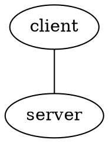
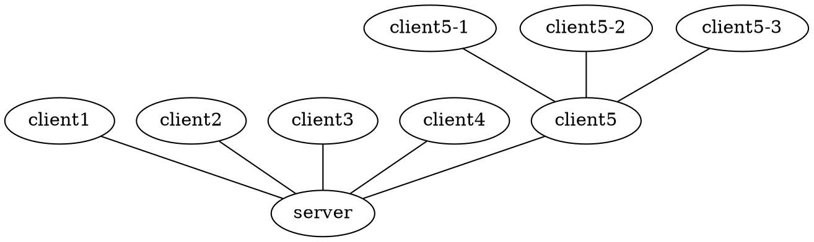

# lnet -- Simplified Lightning Network Setup

Have you ever tried setting up a small Lightning Network on regtest to
develop or demo against, and found it frustrating and confusing?
`lnet`'s goal is to make it easy to spin up any network topology for
testing or demoing, all you need to do is describe the network in the
graphviz `dot` format.

Take the following example, which will spin up two nodes, called
`client` and `server` respectively, connect them and fund a
channel. It'll also create an invoice on the server to balance the
channel by sending over 500'000msat. You describe it, we make it
happen.




A more complicated setup could be a star topology and some multi-hop paths:




## Installation

`lnet` is just a simple `pip install` away:

```bash
pip3 install lnet
```

This will install the `lnet-cli` and `lnet-daemon` command line
utilities. `lnet-daemon` starts, monitors and provides access to
`bitcoind` and any number of `c-lightning` nodes, while `lnet-cli` is
used to interact with the daemon and the nodes.

## Usage

All operations are performed through `lnet-cli`, which will start
`lnet-daemon` if required. `lnet-cli` has the following commands:

 - `start [dotfile]` parses the `dotfile`, extracting nodes and
   channels, and tries to recreate the desired topology. It'll open
   channels and confirm them to make the usable, however it currently
   requires that the network topology is not partitioned. See below
   for attributes that are defined.
 - `stop` stops the currently running topology
 - `shutdown` stops the running topology and shuts down the `lnet-daemon`
 - `node [nodename] [rpc_method] [params...]` executes `rpc_method` on
   the node with name `nodename` and the specified `params`. This is
   mainly used as a shorthand to give access without having to
   configure your shell.
 - `alias` configures your shell with a number of aliases to make it
   easy to interact with the daemons without going through
   `lnet-cli`. You can use it with `eval $(lnet-cli alias)`.
   
 
